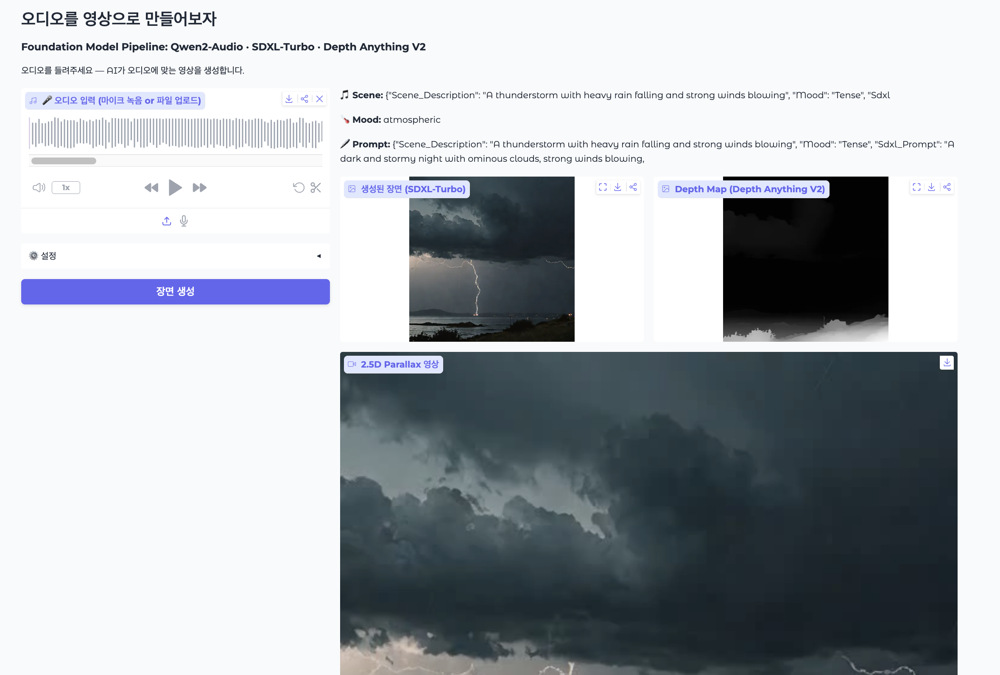

# Sound to Video

> 오디오를 들려주세요 — AI가 그 소리가 만드는 **살아있는 장면**을 생성합니다.

---

## Pipeline

```
🎤 Audio Input (mic / file)
        │
        ▼
┌─────────────────────────┐
│     Qwen2-Audio-7B      │  오디오 이해 → 장면 묘사 + SDXL 프롬프트 자동 생성
│      [Model #1]         │  (audio-language foundation model)
└──────────┬──────────────┘
           │ scene description + prompt
           ▼
┌─────────────────────────┐
│      SDXL-Turbo         │  프롬프트 → 이미지 생성 (4 steps, ~3초)
│      [Model #2]         │  (latent diffusion foundation model)
└──────────┬──────────────┘
           │ generated image
           ▼
┌─────────────────────────┐
│   Depth Anything V2     │  이미지 → depth map 추출
│      [Model #3]         │  (monocular depth foundation model)
└──────────┬──────────────┘
           │ depth map
           ▼
  Parallax Renderer (OpenCV)
  depth-aware 2.5D 움직이는 영상
           │
           ▼
🎬 Output: 원본 오디오 + 살아있는 장면 영상
```

## Models

| # | Model | HuggingFace ID | Role |
|---|-------|----------------|------|
| 1 | **Qwen2-Audio** | `Qwen/Qwen2-Audio-7B-Instruct` | 오디오 이해 → 장면 + 프롬프트 |
| 2 | **SDXL-Turbo** | `stabilityai/sdxl-turbo` | 텍스트 → 이미지 (초고속) |
| 3 | **Depth Anything V2** | `depth-anything/Depth-Anything-V2-Small-hf` | 깊이 추정 |

---

## Requirements

- Python 3.10+
- CUDA GPU (A100 / V100 권장, ~20GB VRAM)
- Conda / Miniconda
- ffmpeg (installed automatically through `environment.yml`)
- 외부 API 키 불필요 — 모든 모델 로컬 실행

---

## Installation

```bash
git clone https://github.com/jueunp/DL_Final_Project.git
cd DL_Final_Project
bash setup.sh
```

`setup.sh` creates a fresh conda environment named `audiodream`, installs ffmpeg,
PyTorch CUDA wheels, and all Python dependencies.

## Run

```bash
conda activate audiodream
python demo.py
# → http://localhost:7860
```


---

## Usage

1. 마이크로 녹음하거나 오디오 파일 업로드 (wav / mp3 / m4a)
2. **장면 생성** 클릭
3. 결과 확인:
   - Qwen2-Audio 분석 결과 (장면 묘사 + 분위기)
   - SDXL-Turbo 생성 이미지
   - Depth Anything V2 깊이 맵
   - 2.5D Parallax 영상 (원본 오디오 포함)
  

## Demo


---

## 코드 구조

- `analyze_audio()`: Qwen2-Audio를 사용해 입력 오디오를 분석하고 SDXL 프롬프트를 생성합니다.
- `generate_image()`: SDXL-Turbo를 사용해 장면 이미지를 생성합니다.
- `get_depth()`: Depth Anything V2를 사용해 깊이 맵을 추정합니다.
- `render_parallax_video()`: 깊이 맵 기반의 2.5D 영상을 렌더링하고 원본 오디오와 합성합니다.
- `run_pipeline()`: 전체 파이프라인을 순차적으로 실행하고 결과를 Gradio UI에 반환합니다.

---

## File Structure

```
audio-dream/
├── demo.py          ← 메인 Gradio 앱 (entry point)
├── environment.yml  ← conda 환경 정의
├── requirements.txt
├── setup.sh
└── README.md
```
